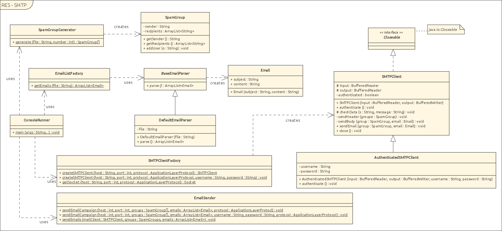

# HEIGVD-RES-2016-Labo-SMTP

## What's this about ?
A simple SMTP client created in the RES course at HEIG-VD in order to become familiar with the protocol.

The idea of this project is to create a java program implementing the basis of the STMP protocol to be able
to send forged e-mails to given victims. The content of the e-mail is selected among a set of pre-defined messages.

We decided to go a bit further and also implemented SMTPs, and SMTPauth, which allows to use most of the
standard email providers. All tests where run against bluewin.ch SMTP server and the one from the HEIG-VD.

## Installation and usage

Dependencies: [vagrant](https://www.vagrantup.com/) (for the mock server, optional) and a version of the [JDK/JRE](https://www.oracle.com/technetwork/java/javase/downloads/index.html) (for the client).

MockMock is a fake SMTP server. This as the advantage that it lets you test this program and other SMTP actions very easily, that is without spamming other people !
You can of course use another fake SMTP server if you have a favorite !

Before anything, begin by downloading or cloning the sources.

### Mock server deployment (with vagrant)
1. Go to root folder (where the .vagrant file is) and type `$ vagrant up`.
2. That's it.
3. The SMTP server will now be listening on port 2525 and the web browser will be listening on port 8080

### Mock server deployment (without vagrant)
1. Download [mockmock](https://raw.githubusercontent.com/tweakers-dev/MockMock/master/release/MockMock.jar)
2. Launch it : java -jar /opt/MockMock.jar -p ${PORT_SMTP} -h ${PORT_BROWSER} 

### Quickstart
1. Compile the sources :

    $ javac -d out **/*.jar
    
2. You can then run the program with the following :
    
    $ cd out; java ch.heigvd.res.smtp.ConsoleRunner host port email_addresses_file number_of_groups email_list [username] [password] [--ssl]

    * host is the FQDN of your SMTP server, localhost with mockmock
    * port is the port on which the SMTP server is listening
    * The email_address_file is a file that should contain an email address per line
    * number_of_groups is the number of groups to create. It should be possible to have at least 3 people in each group
    * email_list this file should contain the emails you'd like to send. One will be picked at random. You can check [email_samples.email](./email_samples.email) to check the format
    * Username, password and ssl are optionals and not supported with MockMock. However you can even send your emails with a real provider !
    
3. That's it, you just sent your forged e-mails.

## Design and implementation

Our code design is shown by the following diagram :

The main point of the design is the SMTPClientFactory and the SMTPClient and subclasses.

Having a factory here allows us to have a good modular design for creating SMTPClients based on wether we need encrypted channels or authentication.

The factory is in charge of creating first the socket on which we connect and then of creating a SMTPClient around it.

We decided to take the same approach for the parsing of email files. This would allow us to retrieve email campaigns from the internet, xml files or whatever other mean easily.

A third place where we did the same, is with the SpamGroupGenerator, which, despite the name is also a factory for spam groups, again for some flexibility.